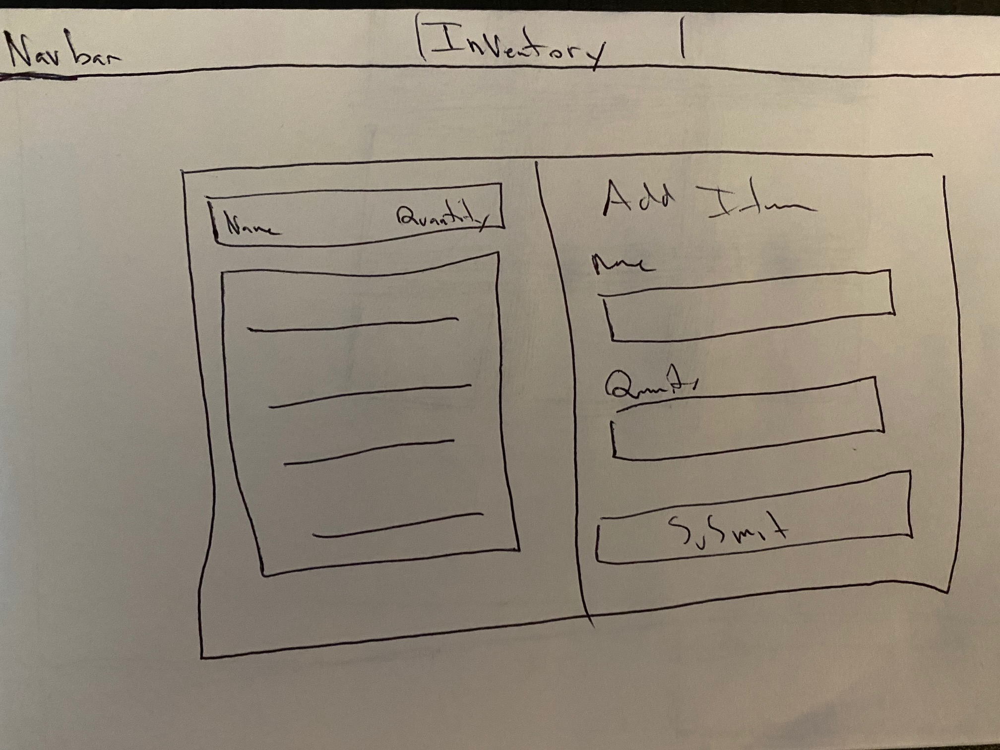

# Inventory List Client
### Description
An app to record and track progress on your inventory list.

### Links
- [Client Repository](https://github.com/Msiperko/inventory-app-client)
- [API Repository](https://github.com/Msiperko/inventory-app-api)
- [Deployed Client](https://msiperko.github.io/inventory-app-client/)
- [Deployed API](https://pacific-spire-61262.herokuapp.com/)

### Technologies Used
* HTML5
* CSS3
* JavaScript
* JQuery
* Semantic UI

# User Stories
* As an unregistered user, I would like to sign up with email and password.
* As a registered user, I would like to sign in with email and password.
* As a signed in user, I would like to change password.
* As a signed in user, I would like to sign out.
* As a signed in user, I would like to create an inventory list item with a name and quantity.
* As a signed in user, I would like to update my inventory list item's name and quantity.
* As a signed in user, I would like to delete my inventory list item.
* As a signed in user, I would like to see all my inventory list items but not other users'.

### Wireframe

